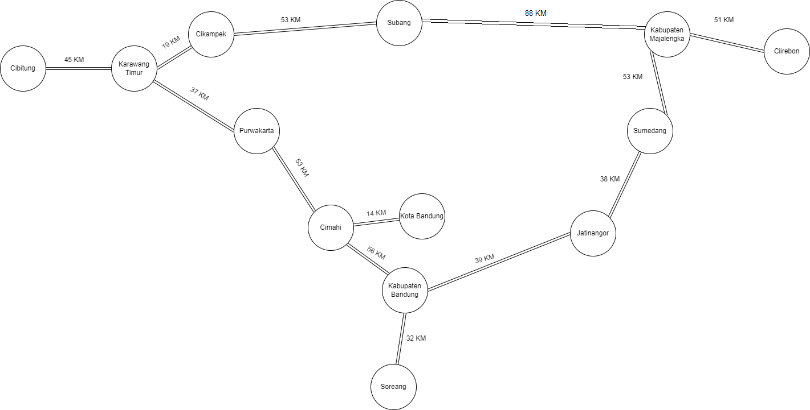
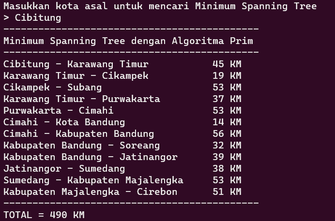
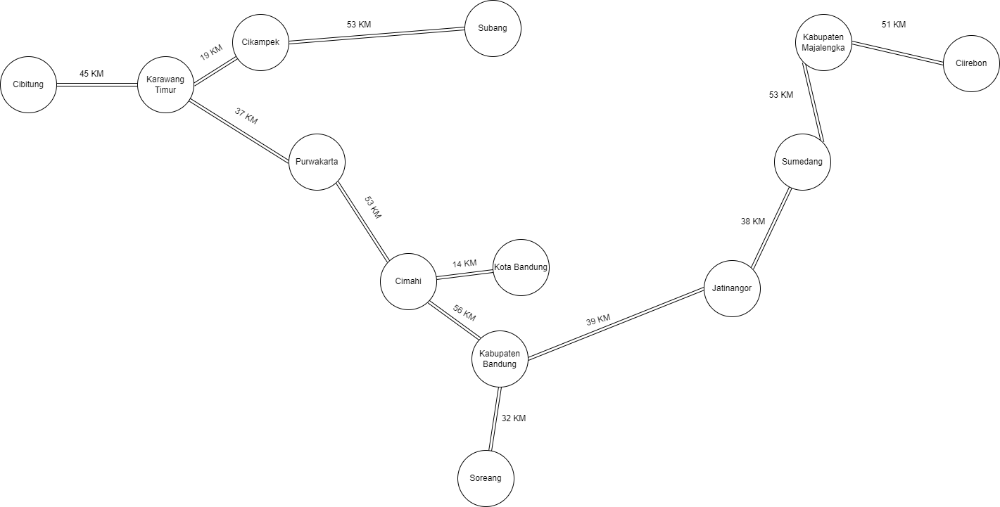

# Tentang
---

<p align="center">
  
</p>

Repositori ini berisi tugas akhir semester 2 (2023) Praktikum Struktur Data dan Algoritma S1 Sistem Informasi UPN Veteran Jakarta dalam mencari Minimum Spanning Tree dari sistem jalan tol Jawa Barat menggunakan algoritma Prim.

Pada teori graf, terdapat beberapa istilah seperti Nodes, Edges, dan Weight. Berikut adalah representasinya pada program ini:
- Nodes = Diartikan sebagai simpul graf, di representasikan oleh kota-kota
- Edges = Diartikan sebagai sisi graf, di representasikan oleh jalan tol yang menghubungkan antar kota
- Weight = Diartikan sebagai bobot sisi graf, di representasikan oleh jarak tiap jalan tol

<br>

# Perhatian
---

Program ini di kompilasi menggunakan `gcc` dari `MinGW-x86_64-w64` khusus untuk OS Windows.

<br>

# Panduan
---

1. Unduh repositori ini sebagai zip atau menggunakan git clone
2. Buka command prompt dan menuju ke kode sumber program ini berada
   
   ```
   cd C:\Users\your-username\Downloads\mst-tol-jabar
   ```
3. Jalankan program pada command prompt
   
   ```
   mst-tol-jabar
   ```

4. Jika terdapat masalah, pastikan Anda mempunyai compiler `gcc` dan meng-kompilasi ulang kode sumber pada perangkat Anda
   
   ```
   gcc mst-tol-jabar.c -o mst-tol-jabar
   ```

<br>

# Referensi
---

Berikut adalah gambar dari graf jalan tol Jawa Barat.



<br>

# Contoh
---

Semisal Anda memasukkan kota `Cibitung` sebagai input, maka akan diperoleh output seperti ini.



<br>Berikut adalah gambaran graf output.<br>

